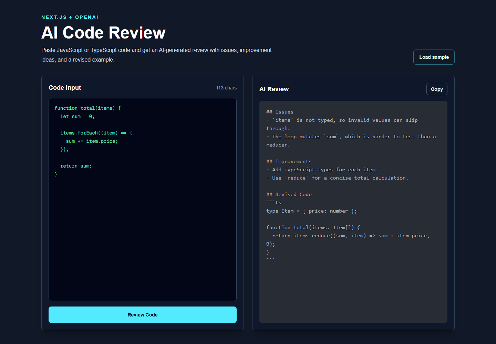

# AI Code Review

AI Code Review is a Next.js app that reviews pasted JavaScript or TypeScript code with the OpenAI API. It returns practical feedback, improvement ideas, and a revised code example in a clean two-panel interface.



## Features

- Paste code and request an AI-generated review
- Review output includes issues, improvements, and revised code
- Copy the generated review to the clipboard
- Responsive interface built with Tailwind CSS
- API route keeps the OpenAI API key on the server

## Tech Stack

- Next.js 16
- React 19
- TypeScript
- Tailwind CSS
- OpenAI Responses API
- react-syntax-highlighter

## Getting Started

Install dependencies:

```bash
npm install
```

Create `.env.local`:

```bash filename=".env.local"
OPENAI_API_KEY=your_openai_api_key
```

Run the development server:

```bash
npm run dev
```

Open [http://localhost:3000](http://localhost:3000) in your browser.

## Scripts

```bash
npm run dev
npm run build
npm run start
npm run lint
```

## Website Project Entry

Use this object when adding the project to a multilingual portfolio or project list. Update the URLs if your deployed site uses a different path.

```ts
export const aiCodeReviewProject = {
  slug: "ai-code-review",
  title: {
    en: "AI Code Review",
    ko: "AI 코드 리뷰",
    ja: "AIコードレビュー",
  },
  description: {
    en: "A Next.js app that analyzes pasted code with the OpenAI API and returns issues, improvement ideas, and revised code.",
    ko: "OpenAI API로 붙여 넣은 코드를 분석하고 문제점, 개선 아이디어, 수정 예시 코드를 제공하는 Next.js 앱입니다.",
    ja: "OpenAI APIで貼り付けたコードを分析し、問題点、改善案、修正版コードを返すNext.jsアプリです。",
  },
  highlights: {
    en: [
      "Built a two-panel review workspace for input and AI feedback",
      "Protected the OpenAI API key inside a server-side route handler",
      "Added copy-to-clipboard and sample-code workflows",
    ],
    ko: [
      "입력 코드와 AI 피드백을 나란히 보는 2패널 리뷰 화면 구현",
      "서버 라우트 핸들러에서 OpenAI API 키를 안전하게 관리",
      "클립보드 복사와 샘플 코드 불러오기 흐름 추가",
    ],
    ja: [
      "入力コードとAIフィードバックを並べて確認できる2ペインUIを実装",
      "サーバー側のルートハンドラーでOpenAI APIキーを安全に管理",
      "クリップボードコピーとサンプルコード読み込みの操作を追加",
    ],
  },
  techStack: ["Next.js", "React", "TypeScript", "Tailwind CSS", "OpenAI API"],
  image: "/screenshots/ai-code-review.png",
  repositoryUrl: "https://github.com/hyeonjo00/ai-code-review",
  demoUrl: "",
};
```
